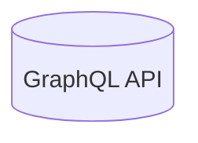

# Diagrams

## Overview

| Diagram | Type | Description |
|---------|------|-------------|
| vite-react - Page Navigation | `FLOWCHART` | Auto-generated |
| vite-react - Data Flow | `FLOWCHART` | Auto-generated |
| vite-react - Component Hierarchy | `FLOWCHART` | Auto-generated |
| vite-react - GraphQL Operations | `FLOWCHART` | Auto-generated |

## vite-react - Page Navigation

`TYPE: FLOWCHART`

```mermaid
flowchart TB
  %% Page Navigation Flow - Grouped by Category

  subgraph src["/src"]
    direction TB
    P0["pages/public/ServicesGateway AUTH"]
    P1["pages/public/ProductList AUTH"]
    P2["pages/public/ProductDetailsPage AUTH"]
    P3["pages/public/ProductDetail AUTH"]
    P4["pages/public/Home AUTH"]
    P5["pages/public/Help AUTH"]
    P6["pages/public/Contact AUTH"]
    P7["pages/public/About AUTH"]
    P8["pages/messaging/ServicesInbox AUTH"]
    P9["pages/messaging/ServicesChat AUTH"]
    P10["pages/messaging/Inbox AUTH"]
    P11["pages/messaging/Chat AUTH"]
    P12["pages/auth/Signup AUTH"]
    P13["pages/auth/ServicesSignup AUTH"]
    P14["pages/auth/ResetPassword AUTH"]
    P15["pages/auth/OnboardingWizard AUTH"]
    P16["pages/auth/Login AUTH"]
    P17["pages/auth/ForgotPassword AUTH"]
    P18["pages/factory/FactoryQuotesPage AUTH"]
    P19["pages/factory/FactoryProductionPage AUTH"]
    P20["pages/factory/FactoryDashboardPage AUTH"]
    P21["pages/factory/FactoryConnectionsPage AUTH"]
    P22["pages/errors/ServerError AUTH"]
    P23["pages/errors/NotFound AUTH"]
  end

  %% Navigation Links

  %% Styling
  classDef authRequired fill:#fee2e2,stroke:#ef4444,color:#991b1b
  classDef public fill:#dcfce7,stroke:#22c55e,color:#166534
  class P0 authRequired
  class P1 authRequired
  class P2 authRequired
  class P3 authRequired
  class P4 authRequired
  class P5 authRequired
  class P6 authRequired
  class P7 authRequired
  class P8 authRequired
  class P9 authRequired
  class P10 authRequired
  class P11 authRequired
  class P12 authRequired
  class P13 authRequired
  class P14 authRequired
  class P15 authRequired
  class P16 authRequired
  class P17 authRequired
  class P18 authRequired
  class P19 authRequired
  class P20 authRequired
  class P21 authRequired
  class P22 authRequired
  class P23 authRequired
```

## vite-react - Data Flow

`TYPE: FLOWCHART`

```mermaid
flowchart LR
  %% Data Flow Diagram

  subgraph Queries[📡 Queries]
    direction TB
    A0(("GraphQL: OrderSuccessPage"))
    C1["OrderSuccessPage"]
    A0 --> C1
    A2(("GraphQL: OrderDetailPage"))
    C3["OrderDetailPage"]
    A2 --> C3
    A4(("GraphQL: useMessages"))
    C5["useMessages"]
    A4 --> C5
    A6(("GraphQL: useConversations"))
    C7["useConversations"]
    A6 --> C7
    A8(("GraphQL: useConversationDeals"))
    C9["useConversationDeals"]
    A8 --> C9
    A10(("GraphQL: useQuoteRequests"))
    C11["useQuoteRequests"]
    A10 --> C11
    A12(("GraphQL: useUpdateQuoteRequest"))
    C13["useUpdateQuoteRequest"]
    A12 --> C13
    A14(("GraphQL: useCreateQuoteRequest"))
    C15["useCreateQuoteRequest"]
    A14 --> C15
    A16(("GraphQL: useProductionOrders"))
    C17["useProductionOrders"]
    A16 --> C17
    A18(("GraphQL: useUpdateProductionStatus"))
    C19["useUpdateProductionStatus"]
    A18 --> C19
    A20(("GraphQL: useProductionLogs"))
    C21["useProductionLogs"]
    A20 --> C21
    A22(("GraphQL: useFactoryConnections"))
    C23["useFactoryConnections"]
    A22 --> C23
    A24(("GraphQL: useUpdateConnectionStatus"))
    C25["useUpdateConnectionStatus"]
    A24 --> C25
    A26(("GraphQL: useCreateFactoryConnection"))
    C27["useCreateFactoryConnection"]
    A26 --> C27
    A28(("GraphQL: useFactoryAnalytics"))
    C29["useFactoryAnalytics"]
    A28 --> C29
  end

  subgraph Mutations[✏️ Mutations]
    direction TB
    C9["useConversationDeals"]
    A8(("GraphQL: useConversationDeals"))
    C9 --> A8
    C11["useQuoteRequests"]
    A10(("GraphQL: useQuoteRequests"))
    C11 --> A10
    C13["useUpdateQuoteRequest"]
    A12(("GraphQL: useUpdateQuoteRequest"))
    C13 --> A12
    C15["useCreateQuoteRequest"]
    A14(("GraphQL: useCreateQuoteRequest"))
    C15 --> A14
    C17["useProductionOrders"]
    A16(("GraphQL: useProductionOrders"))
    C17 --> A16
    C19["useUpdateProductionStatus"]
    A18(("GraphQL: useUpdateProductionStatus"))
    C19 --> A18
    C21["useProductionLogs"]
    A20(("GraphQL: useProductionLogs"))
    C21 --> A20
    C23["useFactoryConnections"]
    A22(("GraphQL: useFactoryConnections"))
    C23 --> A22
    C25["useUpdateConnectionStatus"]
    A24(("GraphQL: useUpdateConnectionStatus"))
    C25 --> A24
    C27["useCreateFactoryConnection"]
    A26(("GraphQL: useCreateFactoryConnection"))
    C27 --> A26
  end

  %% Styling
  classDef query fill:#dbeafe,stroke:#3b82f6,color:#1e40af
  classDef mutation fill:#fce7f3,stroke:#ec4899,color:#9d174d
  classDef context fill:#d1fae5,stroke:#10b981,color:#065f46
```

## vite-react - Component Hierarchy

`TYPE: FLOWCHART`

```mermaid
flowchart TB
  %% Component Hierarchy
  subgraph Presentationals
    VercelAnalytics["VercelAnalytics"]
    DropdownMenuShortcut["DropdownMenuShortcut"]
    DialogHeader["DialogHeader"]
    DialogFooter["DialogFooter"]
    Badge["Badge"]
    StartConversationDialog["StartConversationDialog"]
    Pagination["Pagination"]
    NearbySellersDialog["NearbySellersDialog"]
    LocationSettings["LocationSettings"]
    LoadingSpinner["LoadingSpinner"]
    FloatingActionButton["FloatingActionButton"]
    EmptyState["EmptyState"]
    StarRating["StarRating"]
    SearchBar["SearchBar"]
    ProductGrid["ProductGrid"]
    ProductGallery["ProductGallery"]
    ProductCard["ProductCard"]
    FilterSidebar["FilterSidebar"]
    FilterContent["FilterContent"]
    ThemeToggle["ThemeToggle"]
  end
  subgraph Containers
    ToastProvider["ToastProvider"]
    ProviderProfilePage["ProviderProfilePage"]
    ProviderDashboardPage["ProviderDashboardPage"]
    CreateProviderProfile["CreateProviderProfile"]
    ServiceProviderCard["ServiceProviderCard"]
  end
  subgraph Layouts
    Layout["Layout"]
  end
  subgraph Hooks
    useServices["useServices"]
    useTypingStatus["useTypingStatus"]
    useSendMessage["useSendMessage"]
    useMessages["useMessages"]
    useConversations["useConversations"]
    useConversationDeals["useConversationDeals"]
    useConversationCreate["useConversationCreate"]
    useQuoteRequests["useQuoteRequests"]
    useUpdateQuoteRequest["useUpdateQuoteRequest"]
    useCreateQuoteRequest["useCreateQuoteRequest"]
    useProductionOrders["useProductionOrders"]
    useUpdateProductionStatus["useUpdateProductionStatus"]
    useProductionLogs["useProductionLogs"]
    useFactoryConnections["useFactoryConnections"]
    useUpdateConnectionStatus["useUpdateConnectionStatus"]
    useCreateFactoryConnection["useCreateFactoryConnection"]
    useFactoryAnalytics["useFactoryAnalytics"]
  end
  StartConversationDialog --> Button
  StartConversationDialog --> Dialog
  StartConversationDialog --> DialogContent
  Pagination --> Button
  Pagination --> Select
  NearbySellersDialog --> Button
  NearbySellersDialog --> Dialog
  NearbySellersDialog --> DialogContent
  LocationSettings --> useProfileLocation
  LocationSettings --> Button
  LocationSettings --> Card
  FloatingActionButton --> useConversations
  FloatingActionButton --> Avatar
  FloatingActionButton --> Button
  SearchBar --> Input
  SearchBar --> Button
  SearchBar --> ROUTES
  ProductGrid --> ProductCard
  ProductGrid --> Skeleton
  ProductGrid --> Product
  ProductGallery --> Button
  ProductGallery --> Json
  ProductCard --> Card
  ProductCard --> CardContent
  ProductCard --> Button
  FilterSidebar --> Button
  FilterSidebar --> Input
  FilterSidebar --> Label
  FilterContent --> Button
  FilterContent --> Input
  FilterContent --> Label
  ThemeToggle --> useTheme
  ThemeToggle --> Button
  ThemeToggle --> DropdownMenu
  ServicesHeader --> useAuth
  ServicesHeader --> Button
  ServicesHeader --> DropdownMenu
  MobileNav --> useAuth
  MobileNav --> Button
  MobileNav --> ROUTES
  Layout --> Header
  Layout --> ServicesHeader
  Layout --> Footer
  Header --> useTheme
  Header --> useAuth
  Header --> useCart
  Footer --> ROUTES
  Footer --> Separator
  ServicesGateway --> Button
  ServicesGateway --> Card
```

## vite-react - GraphQL Operations

`TYPE: FLOWCHART`

