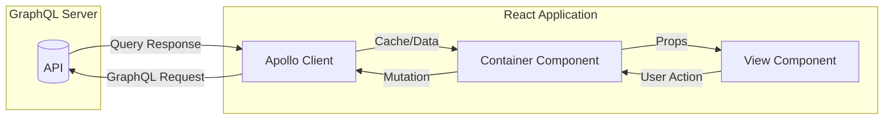

# vite-react - Data Flow

## Overview

| Type | Count | Direction |
|------|-------|-----------|
| `QUERY` | 15 | Server → Component |
| `MUTATION` | 10 | Component → Server |
| `CONTEXT` | 0 | Provider → Consumer |
| **Total** | **25** | |

## Architecture

## Page Data Flows

  Show:
  <label class="ops-toggle"><input type="checkbox" data-filter="direct" checked> Direct</label>
  <label class="ops-toggle"><input type="checkbox" data-filter="close" checked> Close</label>
  <label class="ops-toggle"><input type="checkbox" data-filter="indirect" checked> Indirect</label>
  <label class="ops-toggle"><input type="checkbox" data-filter="common"> Common</label>

### /src/pages/public/ServicesGateway

`FILE: src\pages\public\ServicesGateway.tsx`

---

### /src/pages/public/ProductList

`FILE: src\pages\public\ProductList.tsx`

---

### /src/pages/public/ProductDetailsPage

`FILE: src\pages\public\ProductDetailsPage.tsx`

---

### /src/pages/public/ProductDetail

`FILE: src\pages\public\ProductDetail.tsx`

---

### /src/pages/public/Home

`FILE: src\pages\public\Home.tsx`

---

### /src/pages/public/Help

`FILE: src\pages\public\Help.tsx`

---

### /src/pages/public/Contact

`FILE: src\pages\public\Contact.tsx`

---

### /src/pages/public/About

`FILE: src\pages\public\About.tsx`

---

### /src/pages/messaging/ServicesInbox

`FILE: src\pages\messaging\ServicesInbox.tsx`

---

### /src/pages/messaging/ServicesChat

`FILE: src\pages\messaging\ServicesChat.tsx`

---

### /src/pages/messaging/Inbox

`FILE: src\pages\messaging\Inbox.tsx`

---

### /src/pages/messaging/Chat

`FILE: src\pages\messaging\Chat.tsx`

---

### /src/pages/auth/Signup

`FILE: src\pages\auth\Signup.tsx`

---

### /src/pages/auth/ServicesSignup

`FILE: src\pages\auth\ServicesSignup.tsx`

---

### /src/pages/auth/ResetPassword

`FILE: src\pages\auth\ResetPassword.tsx`

---

### /src/pages/auth/OnboardingWizard

`FILE: src\pages\auth\OnboardingWizard.tsx`

---

### /src/pages/auth/Login

`FILE: src\pages\auth\Login.tsx`

---

### /src/pages/auth/ForgotPassword

`FILE: src\pages\auth\ForgotPassword.tsx`

---

### /src/pages/factory/FactoryQuotesPage

`FILE: src\pages\factory\FactoryQuotesPage.tsx`

---

### /src/pages/factory/FactoryProductionPage

`FILE: src\pages\factory\FactoryProductionPage.tsx`

---

### /src/pages/factory/FactoryDashboardPage

`FILE: src\pages\factory\FactoryDashboardPage.tsx`

---

### /src/pages/factory/FactoryConnectionsPage

`FILE: src\pages\factory\FactoryConnectionsPage.tsx`

---

### /src/pages/errors/ServerError

`FILE: src\pages\errors\ServerError.tsx`

---

### /src/pages/errors/NotFound

`FILE: src\pages\errors\NotFound.tsx`

---

